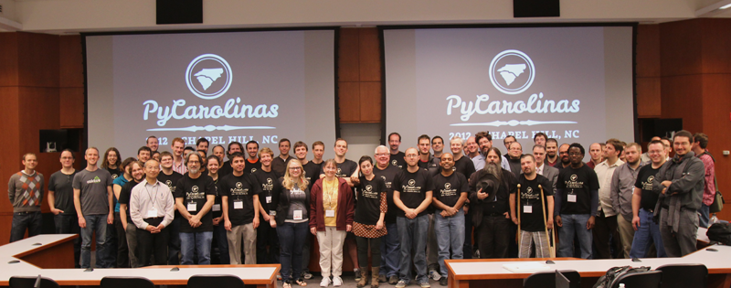

I ran a conference.

I said it had to be done, apparently I said I'd even be the one to do it. Before I knew it, I was doing it and now its over.

All the way up to the date of our inaugural year I was feeling unprepared, afraid I was forgetting terrible things, or simply that the event would be uneventful. I could not have been more unprepared for the sheer success of PyCarolinas, from the presentations everyone was able to enjoy to the success of the food and drinks we provided to keep them all going to the amazing sense of community and connectedness everyone at the conference obviously felt.

Preparing
^^^^^^^^^

This was not only the first conference I ran, but the first involvement in running an event beyond a dozen-person hacknight for `TriZPUG <http://trizpug.org>`_, so "out of my comfort zone" accurately describes how I felt during the months leading up to October 20th and 21st.
